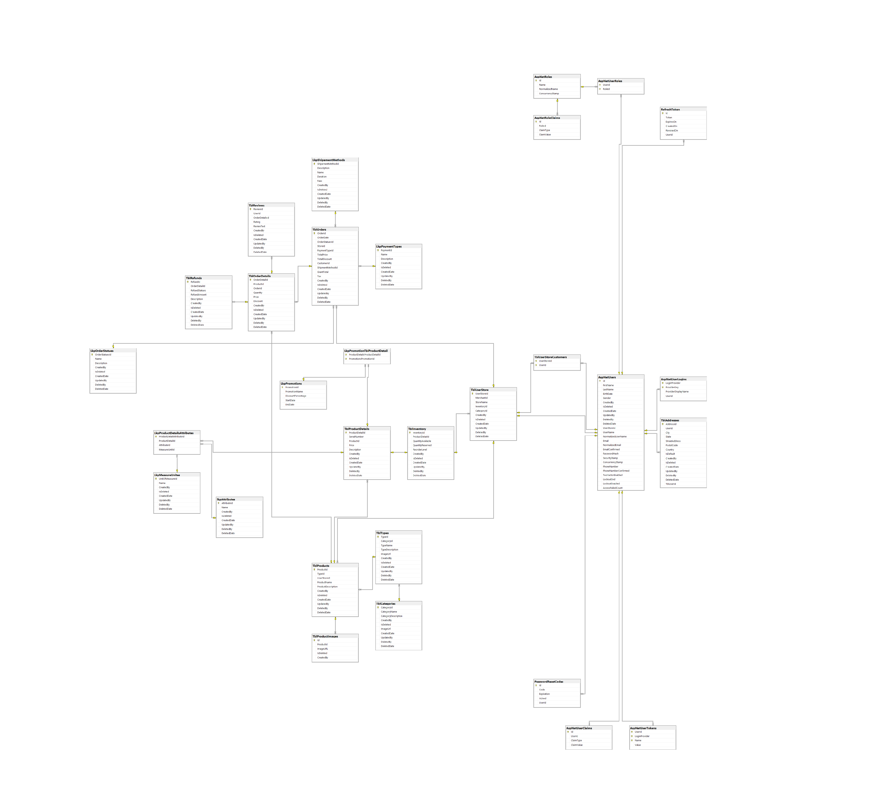

# 🛒 Cartify — Full-Stack E-Commerce Platform  

[](./LICENSE)
[](https://github.com/Taqey/Cartify/issues)
[](https://github.com/Taqey/Cartify/pulls)
[](https://github.com/Taqey/Cartify/stargazers)
[](https://github.com/Taqey/Cartify/network/members)

[](#)
[](#)
[](#)
[](#)
[](#)

---

## 📋 Table of Contents

- [Overview](#-overview)
- [Features](#-features)
- [Architecture](#-architecture-overview)
- [Database Design](#-database-design)
- [Tech Stack](#️-tech-stack)
- [Project Structure](#-project-structure)
- [Authentication & Security](#-authentication--security)
- [API Endpoints](#-api-endpoints)
- [Setup & Installation](#️-setup--installation)
- [Development Status](#-development-status)
- [Roadmap](#-roadmap)
- [Team](#-team)
- [Contributing](#-contributing)
- [License](#-license)

---

## 🧩 Overview

**Cartify** is a modern, full-stack **E-Commerce platform** built with **ASP.NET Core 9** following **Clean Architecture** principles and **SOLID** design patterns.

The platform delivers:
- 🚀 **Scalable architecture** for growing businesses
- 🔧 **Maintainable codebase** with clear separation of concerns
- 🎯 **Role-based access** for Customers, Merchants, and Admins
- 📦 **Product variants system** with inventory management
- 💳 **Secure payment processing** and order tracking

---

## ✨ Features

### 👤 Customer Portal
- 🏠 **Home Page** — Browse featured products, categories, and deals
- 🗂️ **Categories** — Filter and sort products by multiple criteria
- 📦 **Product Details** — View specs, images, reviews, and ratings
- 🛒 **Cart Management** — Add/remove items, apply coupons
- 💳 **Checkout** — Multiple payment options (COD, Card, Wallet)
- 🚚 **Order Tracking** — Real-time order status updates
- 💖 **Wishlist** — Save products for later
- ⚙️ **Profile Management** — Update personal info, addresses, payment methods
- 🔔 **Notifications** — Get alerts for offers and order updates
- 💬 **Support Center** — FAQs, tickets, and live chat

### 🏬 Merchant Dashboard
- 🏢 **Store Management** — Register and configure your store
- 📊 **Analytics Dashboard** — Sales metrics, charts, and insights
- 🛍️ **Product Management** — Full CRUD with variants support
- 📦 **Order Management** — Process and track customer orders
- 💹 **Revenue Reports** — Track top products and earnings

### 🧑‍💻 Admin Panel
- 🖥️ **Global Dashboard** — Platform-wide statistics and monitoring
- 👥 **User Management** — Approve, suspend, or manage accounts
- 🏪 **Store Control** — Oversee all merchant stores
- 📦 **Product Oversight** — Review and manage all listings
- 🗂️ **Category Management** — Organize product categories
- 📑 **Reports & Analytics** — Export data in CSV/Excel formats
- ⚙️ **Platform Settings** — Configure payments, shipping, policies

---

## 🧱 Architecture Overview

Cartify implements **Clean Architecture** with four distinct layers:

```
┌─────────────────────────────────────────────────────────────┐
│                   🎨 Presentation Layer                     │
│            API Controllers • Middlewares • DTOs             │
└─────────────────────────────────────────────────────────────┘
                              ↓
┌─────────────────────────────────────────────────────────────┐
│                   ⚙️ Application Layer                      │
│         Business Logic • Services • CQRS • Validators       │
└─────────────────────────────────────────────────────────────┘
                              ↓
┌─────────────────────────────────────────────────────────────┐
│                     💎 Domain Layer                         │
│       Entities • Value Objects • Domain Events • Rules      │
└─────────────────────────────────────────────────────────────┘
                              ↑
┌─────────────────────────────────────────────────────────────┐
│                   🔧 Infrastructure Layer                   │
│    EF Core • Repositories • External APIs • Data Access     │
└─────────────────────────────────────────────────────────────┘
```

### 🎯 Design Patterns
- ✅ **Repository Pattern** — Data access abstraction
- ✅ **Unit of Work** — Transaction management
- ✅ **CQRS** — Command and Query separation
- ✅ **Dependency Injection** — Loose coupling
- ✅ **DTO Pattern** — Data transfer objects with AutoMapper
- ✅ **Specification Pattern** — Complex query building

---

## 🗄️ Database Design

### Entity Relationship Diagram



### 📌 Core Entities

| Entity | Description |
|--------|-------------|
| **User** | System users with roles: `Client`, `StoreOwner`, `Admin` |
| **Store** | Merchant stores linked to users |
| **Category** | Product categories (hierarchical) |
| **SubCategory** | Category subdivisions |
| **Product** | Base product information |
| **ProductDetail** | Product variants (color, size, storage, etc.) |
| **Inventory** | Stock quantity and pricing per variant |
| **Order** | Customer orders with status tracking |
| **OrderItem** | Individual items in an order |
| **Review** | Product reviews with ratings |
| **Coupon** | Discount codes and promotions |
| **RefreshToken** | JWT refresh token storage |

### 🔗 Key Relationships
- `Category` → `SubCategory` — **One-to-Many**
- `Product` → `ProductDetail` — **One-to-Many**
- `ProductDetail` → `Inventory` — **One-to-One**
- `User` → `Store` — **One-to-One**
- `User` → `Order` — **One-to-Many**
- `Order` → `OrderItem` — **One-to-Many**
- `Product` → `Review` — **One-to-Many**

---

## 🛠️ Tech Stack

### 💻 Frontend


### ⚙️ Backend


**Key Libraries:**
- AutoMapper — Object-to-object mapping
- FluentValidation — Input validation
- JWT Bearer — Authentication
- Serilog — Structured logging

### 🧰 DevOps & Tools


---

## 📂 Project Structure

```bash
Cartify/
├── 📁 frontend/                    # Client-side application
│   ├── index.html
│   ├── css/
│   ├── js/
│   └── assets/
│
├── 📁 backend/                     # Server-side application
│   ├── Cartify.API/               # 🎨 Presentation Layer
│   │   ├── Controllers/
│   │   ├── Middlewares/
│   │   └── Program.cs
│   │
│   ├── Cartify.Application/       # ⚙️ Application Layer
│   │   ├── Services/
│   │   ├── DTOs/
│   │   ├── Validators/
│   │   └── Interfaces/
│   │
│   ├── Cartify.Domain/            # 💎 Domain Layer
│   │   ├── Entities/
│   │   ├── ValueObjects/
│   │   ├── Enums/
│   │   └── Exceptions/
│   │
│   ├── Cartify.Infrastructure/    # 🔧 Infrastructure Layer
│   │   ├── Data/
│   │   ├── Repositories/
│   │   ├── Configurations/
│   │   └── Migrations/
│   │
│   └── Cartify.sln
│
├── 📁 icons/                       # Project assets
│   └── CartifyDbDiagram.png       # Database ERD
│
├── 📁 docs/                        # Documentation
│   ├── API.md
│   └── ARCHITECTURE.md
│
├── 📁 scripts/                     # Automation scripts
│   ├── seed-data.sql
│   └── deploy.sh
│
├── .gitignore
├── README.md
└── LICENSE
```

---

## 🔐 Authentication & Security

### JWT-Based Authentication
- **Access Tokens** — Short-lived (15 minutes)
- **Refresh Tokens** — Long-lived (7 days) with rotation
- Stored using EF Core **owned entities** pattern

### Role-Based Authorization
```csharp
[Authorize(Roles = "Admin")]
[Authorize(Roles = "Merchant")]
[Authorize(Roles = "Client")]
```

### Security Best Practices
- ✅ HTTPS enforcement
- ✅ Strong password policies
- ✅ Token expiration & refresh rotation
- ✅ SQL injection prevention (parameterized queries)
- ✅ XSS protection
- ✅ CORS configuration
- ✅ Rate limiting
- ✅ Centralized exception handling
- ✅ Audit logging for sensitive operations

---

## 📡 API Endpoints

### 🔑 Authentication
```http
POST   /api/auth/register          # Register new user
POST   /api/auth/login             # Login & get tokens
POST   /api/auth/refresh           # Refresh access token
POST   /api/auth/logout            # Invalidate tokens
```

### 🛍️ Products
```http
GET    /api/products               # List all products (paginated)
GET    /api/products/{id}          # Get product details
POST   /api/products               # Create product [Merchant]
PUT    /api/products/{id}          # Update product [Merchant]
DELETE /api/products/{id}          # Delete product [Merchant]
GET    /api/products/search        # Search products
```

### 🛒 Orders
```http
GET    /api/orders                 # Get user orders
GET    /api/orders/{id}            # Get order details
POST   /api/orders                 # Create new order
PUT    /api/orders/{id}/status     # Update order status [Merchant]
DELETE /api/orders/{id}            # Cancel order
```

### 🏬 Merchant
```http
GET    /api/merchant/dashboard     # Get analytics
GET    /api/merchant/orders        # Get store orders
GET    /api/merchant/products      # Get store products
POST   /api/merchant/products      # Add product
```

### 🧑‍💻 Admin
```http
GET    /api/admin/dashboard        # Platform statistics
GET    /api/admin/users            # Manage users
GET    /api/admin/stores           # Manage stores
POST   /api/admin/categories       # Manage categories
```

---

## ⚙️ Setup & Installation

### Prerequisites
- .NET 9 SDK
- SQL Server 2019+
- Node.js (for frontend tooling)
- Docker (optional)

### 🚀 Quick Start

#### 1️⃣ Clone Repository
```bash
git clone https://github.com/Taqey/Cartify.git
cd Cartify
```

#### 2️⃣ Configure Database
Edit `backend/Cartify.API/appsettings.json`:

```json
{
  "ConnectionStrings": {
    "DefaultConnection": "Server=.;Database=CartifyDB;Trusted_Connection=True;TrustServerCertificate=True"
  },
  "Jwt": {
    "Key": "your-super-secret-key-at-least-32-characters-long",
    "Issuer": "Cartify",
    "Audience": "Cartify.Clients",
    "AccessTokenMinutes": 15,
    "RefreshTokenDays": 7
  }
}
```

#### 3️⃣ Apply Migrations
```bash
cd backend
dotnet ef database update --project Cartify.Infrastructure --startup-project Cartify.API
```

#### 4️⃣ Run Backend
```bash
dotnet run --project Cartify.API
```

API will be available at: `https://localhost:5001`  
Swagger UI: `https://localhost:5001/swagger`

#### 5️⃣ Run Frontend
```bash
cd frontend
# Simple HTTP server
npx serve .

# Or just open index.html in browser
```

---

### 🐳 Docker Deployment

**Build Image:**
```bash
docker build -t cartify-api -f backend/Dockerfile .
```

**Run Container:**
```bash
docker run -d -p 8080:8080 --name cartify cartify-api
```

**Docker Compose** (coming soon):
```bash
docker-compose up -d
```

---

## 📊 Development Status

| Module | Status | Progress |
|--------|--------|----------|
| 🎨 Frontend UI | ✅ Complete | 100% |
| 🏗️ Clean Architecture | ✅ Complete | 100% |
| 🔐 Authentication | ✅ Complete | 100% |
| 📦 Product Management | ✅ Complete | 100% |
| 🛒 Cart & Checkout | 🔄 In Progress | 80% |
| 📊 Inventory System | 🔄 In Progress | 75% |
| 🚚 Order Tracking | 🔄 In Progress | 70% |
| 🏬 Merchant Dashboard | 🔄 In Progress | 60% |
| 🧑‍💻 Admin Panel | ⏳ Planned | 40% |
| 💳 Payment Gateway | ⏳ Planned | 0% |
| 🔔 Notifications | ⏳ Planned | 0% |
| 🚀 CI/CD Pipeline | 🔄 In Progress | 50% |

---

## 🗺️ Roadmap

### Phase 1: Core Features ✅
- [x] Project architecture setup
- [x] Database design & migrations
- [x] Authentication & authorization
- [x] Product catalog system
- [x] Basic UI components

### Phase 2: E-Commerce Features 🔄
- [x] Shopping cart functionality
- [x] Product variants & inventory
- [ ] Checkout process
- [ ] Order management
- [ ] Payment integration (Stripe/PayPal)

### Phase 3: Advanced Features ⏳
- [ ] Email notifications
- [ ] Push notifications
- [ ] Advanced search & filters
- [ ] Product recommendations
- [ ] Analytics dashboard
- [ ] Review & rating system

### Phase 4: DevOps & Deployment 🔄
- [ ] Unit & integration tests
- [ ] CI/CD pipeline (GitHub Actions)
- [ ] Docker containerization
- [ ] Cloud deployment (AWS/Azure)
- [ ] Performance optimization
- [ ] Load testing

---

## 👥 Team

| Member | Role | GitHub | LinkedIn |
|--------|------|--------|----------|
| **Ahmed Ayad** | Backend Architect | [@a7med3yad](https://github.com/a7med3yad) | [Profile](#) |
| **Taqey Eldeen** | Full Stack Developer | [@Taqey](https://github.com/Taqey) | [Profile](#) |
| **Mark Osama** | Frontend Developer | [@MarkOsama](#) | [Profile](#) |
| **Mohamed Raouf** | Backend Developer | [@MohamedRaouf](#) | [Profile](#) |
| **Mustafa Nasr** | DevOps Engineer | [@MustafaNasr](#) | [Profile](#) |

---

## 🤝 Contributing

We welcome contributions! Here's how you can help:

1. **Fork** the repository
2. **Create** a feature branch
   ```bash
   git checkout -b feature/AmazingFeature
   ```
3. **Commit** your changes
   ```bash
   git commit -m 'Add some AmazingFeature'
   ```
4. **Push** to the branch
   ```bash
   git push origin feature/AmazingFeature
   ```
5. **Open** a Pull Request

### Contribution Guidelines
- Follow the existing code style
- Write meaningful commit messages
- Add tests for new features
- Update documentation as needed
- Keep PRs focused and small

---

## 📄 License

This project is licensed under the **MIT License** - see the [LICENSE](./LICENSE) file for details.

---

## 📞 Support & Contact

- 🐛 **Bug Reports:** [GitHub Issues](https://github.com/Taqey/Cartify/issues)
- 💡 **Feature Requests:** [GitHub Discussions](https://github.com/Taqey/Cartify/discussions)
- 📧 **Email:** support@cartify.com
- 💬 **Discord:** [Join our community](#)

---

## 🌟 Show Your Support

If you find this project helpful, please consider:
- ⭐ **Starring** the repository
- 🍴 **Forking** for your own projects
- 📢 **Sharing** with others
- 🐛 **Reporting** bugs
- 💡 **Suggesting** features

---

<div align="center">

**Made with ❤️ by the Cartify Team**

[⬆ Back to Top](#-cartify--full-stack-e-commerce-platform)

</div>